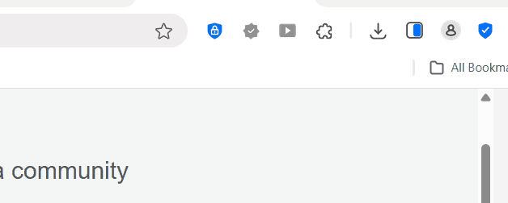

# Web Development Project 1 - *South Florida Favorites*

Submitted by: **Justin Cabrera**

This web app showcases popular restaurants and dining spots loved by the South Florida community. The board displays a collection of restaurant cards that highlight well-known local favorites along with their locations, allowing users to quickly explore great food spots in the area.

Time spent: **2** hours spent in total

## Required Features

The following **required** functionality is completed:

- [✔] **The app has a cohesive, unique theme for events or resources relevant to a specific community**
  - [✔] Header/title describing the theme is displayed
  -[✔] **At least 10 unique events or resources are displayed in a responsive card format**
  - [✔] There are at least 10 cards displayed 
  - [✔] The cards should be displayed in an organized format (ex. a grid, or in one line)
  - [✔] Each card should include some information about the event or resource

The following **optional** features are implemented:

- [✔] Buttons or links to a related resources are on each card component
  - [✔] All cards have buttons or links in addition to text
- [✔] The site is responsive for both desktop and mobile formats
  - [✔] Web app is shown in a mobile format
  - [✔] **Video Walkthrough Special Instructions**: To ease the grading process, please use Chrome Developer Tools' "Toggle Device" button to demonstrate that your web application's responsiveness in both a desktop *and* a mobile format. Detailed instructions can be found below this stretch feature on the project page. 

The following **additional** features are implemented:

* [✔] List anything else that you added to improve the site's functionality!
I learned how to create my own app, building the project, using React components, props, and CSS for styling. Through this project, I learned how to structure a React app, create reusable components, and apply responsive design with CSS Grid. I added a board that displays a collection of restaurant cards that highlight well-known local favorites along with their locations.

## Video Walkthrough

Here's a walkthrough of implemented required features:

GIF created with [ScreenToGif](https://www.screentogif.com/) 

(https://raw.githubusercontent.com/justincabrer2021/Project1-justincabrer2021/main/timetabled/Animation.gif)

## Notes

I was struggling with finding a topic as well as adding images. Based on my studies and learnings on lab 1, I was able to sync my codepath, github, and VScode much smoother and quicker. 

## License

    Copyright [2026]] [Justin Cabrera]

    Licensed under the Apache License, Version 2.0 (the "License");
    you may not use this file except in compliance with the License.
    You may obtain a copy of the License at

        http://www.apache.org/licenses/LICENSE-2.0

    Unless required by applicable law or agreed to in writing, software
    distributed under the License is distributed on an "AS IS" BASIS,
    WITHOUT WARRANTIES OR CONDITIONS OF ANY KIND, either express or implied.
    See the License for the specific language governing permissions and
    limitations under the License.